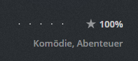
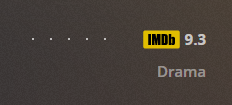

# Rating update tool for IMDB ratings in Plex libraries

A tool to update the IMDB ratings for Plex libraries that contain movies via the IMDB, TMDB and TVDB agents.


<span class="badge-paypal"><a href="https://paypal.me/mynttt" title="Donate to this project using Paypal"></a></span>

## Important

**If you get rating updates on your episodes but not on your TV Shows, you'll have to get access to a TVDB API key. This is because the tool finds IMDB IDs that are associated with the episodes in the database, but for the TV Shows it only finds TVDB IDs that have to be resolved into IMDB IDs by calling their API. Unless you have a key, this is not possible and means that no updates are processed for these items. [You can get a key for free by using their points system.](https://thetvdb.com/points)**

**This tool works with the new Plex TV Show agent. The fallback support however is limited and only supports TVDB v4 and not TMDB v3 right now. This feature is a opt-in so please read [more here](#opt-in-for-libraries-using-the-new-tv-show-agent)! Else the libraries using the new Plex TV Show agent will not be processed by the tool!**

-----

~**Make sure to set `USE_PLEX_SQLITE_BINARY_FOR_WRITE_ACCESS` to `true` in your docker configuration (or if using the GUI, set the path to the Plex SQLite binary) and use at least v1.6.0! Plex non-standard SQLite3 version diverged so strongly from vanilla SQLite3 that not using this feature can cause database corruptions in rare cases. Read more [in the environment variable guide](https://github.com/mynttt/UpdateTool#environment-variables-guide)!**~ => **This is now enforced via the docker instead of being an opt-in in order to protect users from accidental database corruptions. You can still opt-out by setting it to `false`.**

**To run this without docker on Linux in a headless mode check out [this issue](https://github.com/mynttt/UpdateTool/issues/70)!**

**While the DB issues are fixed now and using this tool is likely safe to use and never caused issues for myself and a large part of the user base it shall still be noted that this tool should be used with caution and that I'm not responsible for any damages within your PMS database. The database interaction of this tool is minimal and within the milliseconds realm and the queries are executed cleanly by using SQLite's transactions.**

**This tool could in theory break if either the Plex database schema changes or IMDB stops providing a public rating dataset! This would not be dangerous tho as it stops when something goes wrong.**

**If you want to run this on Windows without docker look [here](https://github.com/mynttt/UpdateTool/wiki/Installation-on-Windows)! There is also a GUI for the tool that is discussed [here](#GUI).**

**TV Show updates are done by aired season / aired episode. If you use DVD order for some reason please create an issue and I will implement a flag for you to switch the tool between. Plex uses aired season / aired episode by default tho!**

## What does this do?

The Plex IMDB agent is kind of meh... Sometimes it is not able to retrieve the ratings for newly released movies even tho it matches the IMDB ID with them. It is impossible to comfortable add the rating manually from the users perspective.

This tool allows you to update the database that stores this data with the correct IMDB ratings. It will correct outdated and missing ratings and also set a flag to display the IMDB badge next to the ratings. The source used to retrieve the ratings is the official IMDB dataset that is updated daily and free for non-commercial use. Its download and refreshment will be handled automatically by this tool.

An advantage is that it works outside Plex by manipulating the local Plex database. Thus, no metadata refresh operations have to be done within Plex. It is faster and will not lead into the unforeseen consequences that one sometimes experiences with a Plex metadata refresh (missing or changed posters if not using a custom poster).

Before (Not IMDB matched)            |  After Match
:-------------------------:|:-------------------------:
  |  

*Above are two different movies, that why the genres changed*

### This tool processes the following libraries:

Type | Description | Agent
:-------------------------:|:-------------------------:|:-------------------------:
MOVIE | Plex Movie Agent with IMDB | com.plexapp.agents.imdb
MOVIE | TMDB Movie Agent (if TMDB API key set) | com.plexapp.agents.themoviedb
MOVIE | New Plex Movie Agent (if IMDB as ratings source set) | tv.plex.agents.movie
TV SHOW | New Plex TV Show Agent (currently only for items that have the IMDB ID embedded in the Plex database and have been opted-in via a special environment variable) | tv.plex.agents.series
TV SHOW | TMDB Series Agent (if TMDB API key set) | com.plexapp.agents.themoviedb
TV SHOW | TVDB Series Agent (if TVDB auth string set) |com.plexapp.agents.thetvdb

In my library with 1800 movies it transformed entries for 698 items and 1000+ entries for series. If it is left running, every few days when a new IMDB data set is pulled a few ratings will update as well.

# Docker

Docker is on [dockerhub](https://hub.docker.com/r/mynttt/updatetool) | [UnRaid instructions](#docker-on-unraid)

## Environment Variables Guide

Name | Description
:-------------------------:|:-------------------------:|
`RESTART_ON_CRASH`|Automatically restarts the tool within the docker in case a crash is encountered. This must be set to `true` to have any effect. Once a crash is encountered, the docker container will not stop anymore but instead wait 10 seconds before trying to launch the tool again.
`USE_PLEX_SQLITE_BINARY_FOR_WRITE_ACCESS`|Allows to use the non-standard Plex SQLite3 version that diverged so strongly from the vanilla flavour that write operations with vanilla SQLite3 can cause database corruptions! Set this to `true` in the docker when using a version >= 1.6.0! This is the only way to be safe from corruptions as Plex continues to diverge from compatibility with vanilla SQLite3! If you're not using a docker version make sure that this points to the `Plex Media Server/Plex SQLite` binary that is located in the main Plex folder next to the `Plex Media Server` executable.
`OVERRIDE_DATABASE_LOCATION`|Overrides the path where UpdateTool looks for the Plex database. The database needs to be contained in this folder. Useful if a docker container uses a volume and a different path structure. ([more here](#override-the-database-location))
`TMDB_API_KEY`|Enables TMDB Movie/Series library processing
`TVDB_API_KEY`|Enables TVDB Series library processing using either the v3 legacy key or the v4 pin
`UNLOCK_FOR_NEW_TV_AGENT`|Opt-in for libraries using the new TV Show agent. All libraries that are opted-in this way will have their ratings changed to IMDB ratings by this tool ([more here](#opt-in-for-libraries-using-the-new-tv-show-agent))
`IGNORE_LIBS`|Ignore libraries with certain IDs ([more here](#Ignore-libraries-from-being-updated))
`CAPABILITIES`|Custom flags for the tool ([more here](#supply-custom-capability-flags))
`JVM_MAX_HEAP`|Only relevant for the docker. Specify max. heap allocatable by the JVM (default 256m). Can be useful if you have a really large library (40000+ items) and you run in memory related crashes. Must be specified in bytes (i.e. 256m, 1g, 2g, 512m)

Deprecated variables can still be used although their usage is discouraged.

### Deprecated Environment Variables
Name | Description | Deprecation
:-------------------------:|:-------------------------:|:-------------------------:|
`TVDB_AUTH_STRING`|Enables TVDB Series library processing|API Key is enough for this tool to work

## Docker on UnRaid

There is a template repository available now: https://github.com/mynttt/unraid-templates

You can add that repository under `Template repositories:` in the UnRaid Docker section, hit save and thus will be able to add UpdateTool via the `Add Container` button.

A configuration skeleton will be added and you will have to set up the `Plex Media Server` directory and optionally your TVDB / TMDB API Keys in case you want to use TMBD / TVDB resolvement.

After completing the configuration steps, you can start the container. If it has errors, it will stop. The log in the config folder shows you what it does or why it crashed if that happens.

*TMDB and TVDB are optional settings that are not required for base movie imdb operations! TMDB unlocks matching for movies that have a TMBD match for whatever reason, TMDB matched series libraries and TVDB allows to update series as well!*

## To run your docker without UnRaid templates:

```bash
docker pull mynttt/updatetool

# Without TMDB fallback

docker run -dit -e RUN_EVERY_N_HOURS=12 \
    -v "/mnt/data/Plex Media Server":/plexdata \
    -v "/mnt/data/imdpupdaterconfig":/config \
    mynttt/updatetool

# With TMDB fallback

docker run -dit -e RUN_EVERY_N_HOURS=12 \
    -e TMDB_API_KEY=yourkey \
    -v "/mnt/data/Plex Media Server":/plexdata \
    -v "/mnt/data/imdpupdaterconfig":/config \
    mynttt/updatetool
    
# With TMDB fallback and TVDB resolvement for series

docker run -dit -e RUN_EVERY_N_HOURS=12 \
    -e TMDB_API_KEY=yourkey \
    -e TVDB_API_KEY=tvdbapikey \
    -v "/mnt/data/Plex Media Server":/plexdata \
    -v "/mnt/data/imdpupdaterconfig":/config \
    mynttt/updatetool
```

Explained:

```bash
docker run -dit 
     # Invoke every 12h
    -e RUN_EVERY_N_HOURS=12 \
     # Optional parameter: will try to get an IMDB ID from TMDB matched items
    -e TMDB_API_KEY=yourkey \
     # Three items are required to auth with TVDB username, userkey, apikey
     # Supply these as semicolon seperated values. Example: username;DAWIDK9CJKWFJAWKF;e33914feabd52e8192011b0ce6c8
    -e TVDB_API_KEY=tvdbapikey \
     # The plex data root (that contains Plug-ins, Metadata, ...
     # https://support.plex.tv/articles/202915258-where-is-the-plex-media-server-data-directory-located/
    -v "/mnt/data/Plex Media Server":/plexdata \
     # A path where you want to store the log and state files
    -v "/mnt/data/imdpupdaterconfig":/config \
    mynttt/updatetool
```

[Where is the data folder of the Plex Media Server located on my system?](https://support.plex.tv/articles/202915258-where-is-the-plex-media-server-data-directory-located/)

[TVDB API Key](https://thetvdb.com/dashboard/account/apikey)

*"/mnt/data/Plex Media Server" and "/mnt/data/imdpupdaterconfig" are just sample paths! Set your own paths there or it will probably not work!*

*On windows the \ syntax to make the command multiline will not work. You have to remove those and make the command a single line command!*

## Other configuration values

### Opt-in for libraries using the new TV Show agent

Because the new agent only allows to choose between TVDB/TMDB ratings via the Plex UI libraries that shall be touched by UpdateTool have to be explicitly opted-in. This is a safety feature to not accidentally wreck libraries of users who wish to not have UpdateTool change their new TV Show agent libraries to IMDB ratings. Until you can set IMDB via the UI this will be the to-go way of having UpdateTool process these libraries.

`UNLOCK_FOR_NEW_TV_AGENT` takes a list of library ids as a semicolon seperated string. You can find the id of a plex library by starting the tool and looking at the beginning of the log. It reports the name, type and ID of all detected libraries.

```
[INFO ] - 2022-01-18 15:21:47 @ ImdbDockerImplementation$ImdbBatchJob.lambda$run$0: Found library [MOVIE] Movies (ID=1) with agent: com.plexapp.agents.imdb and 1831 item(s).
[INFO ] - 2022-01-18 15:21:47 @ ImdbDockerImplementation$ImdbBatchJob.lambda$run$0: Found library [SERIES] TV Shows (ID=7) with agent: com.plexapp.agents.thetvdb and 2382 item(s).
```

**Examples:**

Opting-in only the new TV Show agent library with ID 1: 

```
UNLOCK_FOR_NEW_TV_AGENT="1"
```

Opting-in the new TV Show agent libraries with the IDs 1, 5, 8: 

```
UNLOCK_FOR_NEW_TV_AGENT="1;5;8"
```

### Ignore libraries from being updated

You can ignore libraries by setting the environment variable `IGNORE_LIBS`.

`IGNORE_LIBS` takes a list of library ids as a semicolon seperated string. You can find the id of a plex library by opening it in plex and then looking at the URL in the browser.

The way of finding the matching IDs is by looking at the log when the tool starts - it will report the name, type and ID of the detected libraries:

```
[INFO ] - 2022-01-18 15:21:47 @ ImdbDockerImplementation$ImdbBatchJob.lambda$run$0: Found library [MOVIE] Movies (ID=1) with agent: com.plexapp.agents.imdb and 1831 item(s).
[INFO ] - 2022-01-18 15:21:47 @ ImdbDockerImplementation$ImdbBatchJob.lambda$run$0: Found library [SERIES] TV Shows (ID=7) with agent: com.plexapp.agents.thetvdb and 2382 item(s).
```

**Examples:**

Ignoring only the library with ID 1: 

```
IGNORE_LIBS="1"
```

Ignoring the libraries with the IDs 1, 5, 8: 

```
IGNORE_LIBS="1;5;8"
```

### Supply custom capability flags

You can apply custom flags to the tool via the `CAPABILITIES` environment variable.

Currently the following flags exist:

Flag | Description
:-------------------------:|:-------------------------:|
`NO_TV` |Ignore all TV Show libraries
`NO_MOVIE` | Ignore all Movie libraries
`VERBOSE_XML_ERROR_LOG` | Enable verbose XML error output logging
`DONT_THROW_ON_ENCODING_ERROR` | Supress forced quits if decoding errors of extra data are encountered due to corrupt items in the library
`IGNORE_NO_MATCHING_RESOLVER_LOG`|Supresses printing items that have no matching resolver to the log
`IGNORE_SCRAPER_NO_RESULT_LOG`|Supresses printing web scraper no-match results that either have no rating on the IMDB website or are not allowed to be rated by anyone on the IMDB website and thus will never have ratings
`DISABLE_SCREEN_SCRAPE`|Disables the screen scraping unit (extracts IMDB ratings from the website if not in dataset) in case that there are issues with the IMDB web page such as 503 errors and timeouts that cause unsuccessful results and slow down the metadata lookup process immensely.

Multiple flags can be supplied as a semicolon separated string.

**Examples:**

Don't process TV libraries

```
CAPABILITIES="NO_TV"
```

Render the tool useless by skipping TV and Movie libraries

```
CAPABILITIES="NO_TV;NO_MOVIE"
```

### Override the database location

In some cases it might be required to override the location of the database file as the local folder structure is different from the standardized `Plex Media Folder/Plug-in Support/Databases/*.db` pattern.

The Plex database file (`com.plexapp.plugins.library.db`) has to be in the supplied folder in order for UpdateTool to recognize it.

```
OVERRIDE_DATABASE_LOCATION="/opt/myspecialpath/theplexdb"
```

# Technical details

### Technical Runtime requirements

- Java >= 11

This tool supplies one mode at the moment:

### imdb-docker
Provides a watchdog for scheduled IMDB update operations that once started will run every N hours over all IMDB supported libraries.
The tool is supplied with its parameters via environment variables.

It can then be invoked with:
- no args (every 12h)
- the schedule arg (every n hour(s))

```
java -jar UpdateTool-xxx.jar imdb-docker {}
java -jar UpdateTool-xxx.jar imdb-docker {schedule=12}
```

Example:

```bash
# Export variables if on Linux/Mac
PLEX_DATA_DIR="/mnt/user/Plex Media Server"
export PLEX_DATA_DIR

# Export variables if on Windows
set PLEX_DATA_DIR=C:\User\Data\Plex Media Server

# Default start
java -jar UpdateTool-xxx.jar imdb-docker {}
# Run every 5 hours
java -jar UpdateTool-xxx.jar imdb-docker {schedule=5}
```

### GUI

There is also a GUI to assist users that feel uncomfortable with the CLI way of interacting with the tool. It supports Windows, MacOS and Linux and only [requires the Java 11+ runtime](https://adoptopenjdk.net/?variant=openjdk11&jvmVariant=hotspot) and can be downloaded [here](https://github.com/mynttt/UpdateTool/releases/tag/g1.0.7).


To use the GUI just double click on the jar file. The GUI will automatically download and update the used version of UpdateTool. You are only required to set the path to the Plex Media Server data folder and submit a path to your java executable. If you want to enable TMDB/TVDB resolvement simply tick the boxes and supply the API keys via the text fields. To start and stop the tool use the respective buttons.
