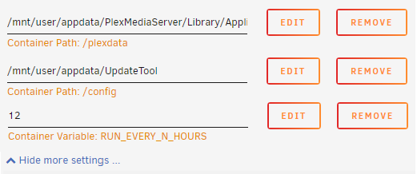

# Rating update tool for IMDB ratings in Plex libraries

A tool to update the IMDB ratings for Plex libraries that contain movies.

## What does this do?

#### This tool could in theory break if either the Plex database schema changes or the OMDB API breaks! This would not be dangerous tho as it stops when something goes wrong. 

The Plex IMDB agent is kind of meh... Sometimes it is not able to retrieve the ratings for newly released movies even tho it matches the IMDB ID with them. It is impossible to comfortable add the rating manually from the users perspective.

This tool allows you to update the database that stores this data with the correct IMDB ratings. It will correct outdated and missing ratings and also set a flag to display the IMDB badge next to the ratings. The source used to retrieve the ratings is the OMDB API.

An advantage is that it works outside Plex by manipulating the local Plex database. Thus, no metadata refresh operations have to be done within Plex. It is faster and will not lead into the unforeseen consequences that one sometimes experiences with a Plex metadata refresh (missing or changed posters if not using a custom poster).

This tool currently only works on movies and will only allow you to select libraries that use the Plex IMDB agent (because it depends on the IMDB ids). In my library with 1800 movies it transformed entries for 698 items. In case that even tho you use the IMDB agent you still have items that are TMDB matched you can run it with an TMDB API key and it will match an IMDB rating to the TMDB item (if TMDB provides an IMDB id).

Before (Not IMDB matched)            |  After Match
:-------------------------:|:-------------------------:
  |  

*These are two different movies, that why the genres changed*

# Docker

Docker is on [dockerhub](https://hub.docker.com/r/mynttt/updatetool).

To run your docker:

```bash
docker pull mynttt/updatetool

# Without TMDB fallback

docker run -dit -e OMDB_API_KEY=yourkey \
    -e RUN_EVERY_N_HOURS=12 \
    -e CLEAR_CACHE_EVERY_N_DAYS=14 \
    -v "/mnt/data/Plex Media Server":/plexdata \
    -v "/mnt/data/imdpupdaterconfig":/config \
    mynttt/updatetool

# With TMDB fallback

docker run -dit -e OMDB_API_KEY=yourkey \
    -e RUN_EVERY_N_HOURS=12 \
    -e CLEAR_CACHE_EVERY_N_DAYS=14 \
    -e TMDB_API_KEY=yourkey \
    -v "/mnt/data/Plex Media Server":/plexdata \
    -v "/mnt/data/imdpupdaterconfig":/config \
    mynttt/updatetool
```

Explained:

```bash
docker run -dit 
     # OMDB Api Key
    -e OMDB_API_KEY=yourkey \
     # Invoke every 12h
    -e RUN_EVERY_N_HOURS=12 \
     # Purge cache entries older than 14 days
    -e CLEAR_CACHE_EVERY_N_DAYS=14 \
     # Optional parameter: will try to get an IMDB ID from TMDB matched items
    -e TMDB_API_KEY=yourkey \
     # The plex data root (that contains Plug-ins, Metadata, ...
     # https://support.plex.tv/articles/202915258-where-is-the-plex-media-server-data-directory-located/
    -v "/mnt/data/Plex Media Server":/plexdata \
     # A path where you want to store the log and state files
    -v "/mnt/data/imdpupdaterconfig":/config \
    mynttt/updatetool
```

*"/mnt/data/Plex Media Server" and "/mnt/data/imdpupdaterconfig" are just sample paths! Set your own paths there or it will probably not work!*

*On windows the \ syntax to make the command multiline will not work. You have to remove those and make the command a single line command!*

## Docker on UnRaid in the docker tab without commands

1.) You need the community application plugin.

2.) Apps -> Settings -> Enable additional search results from dockerHub to "Yes"

3.) Now you need to go to Apps and search for "mynttt".

4.) It will either show the UpdateTool container or nothing and allow you to display Dockerhub search results. Display them and install.

5.) Configure the paths and variables like this (with your own paths and api keys): 

**If you want to use TMDB fallback you will also have to add the variable TMDB_API_KEY!**

**If the /config folder does not exist yet in appdata unraid will create it! It is important to access logs easily!**



6.) You can now start the container. If it has errors it will stop. The log in the config folder shows you what it does or why it crashed if that happens.


# Technical details

This tool supplies two modes at the moment:

### docker mode
Provides a watchdog that once started will run every N hours over all IMDB supported libraries.

### CLI mode (deprecated)
***Don't use this it will be removed in the future and is currently not supported***

***No support for TMDB fallback here***

Provides a CLI wizard to add and process IMDB update jobs on the supporting libraries.

# Runtime requirements

- Java >= 11

# Created files in PWD

- cache-imdb.json - Cache for Agent
- state-imdb.json - Set of jobs that have not finished
- xml-error-{uuid}-{library}.log - List of files that could not be updated by the XML transform step (not important tbh, plex reads from the DB)
- updatetool.log - Log file

# Usage

### Docker mode:

In docker mode the tool will read the environment variables OMDB_API_KEY and PLEX_DATA_DIR and optionally TMDB_API_KEY if TMDB fallback should be enabled.

It can then be invoked with:
- no args (default caching (14 days) and every 12h)
- one arg (default cachning(14 days) and every n hour(s))
- two args (cache purge every n day(s) every n hours(s)) (invoking with 0 days will clear the cache entirely)

```
java -jar UpdateTool-xxx.jar imdb-docker [] | [{every_n_hour}] | [{every_n_hour} {cache_purge_in_days}]
```

Example:

```bash
# Export variables if on Linux/Mac
OMDB_API_KEY=abcdefg
PLEX_DATA_DIR="/mnt/user/Plex Media Server"
export OMDB_API_KEY
export PLEX_DATA_DIR

# Export variables if on Windows
set OMDB_API_KEY=abcdefg
set PLEX_DATA_DIR=C:\User\Data\Plex Media Server

# Default start
java -jar UpdateTool-xxx.jar imdb-docker
# Run every 5 hours
java -jar UpdateTool-xxx.jar imdb-docker 5
# Run every 12 hours but always purge the cache
java -jar UpdateTool-xxx.jar imdb-docker 12 0
```

### Legacy CLI mode (deprecated):

```bash
java -jar UpdateTool-xxx.jar imdb-cli <PlexData> <ApiKey>
```

Parameters
```bash
<PlexData> is the path that points to the Plex Media Server folder which contains folders like Cache, Metadata and Plug-ins
<ApiKey> is an APIKey for the OMDB service https://www.omdbapi.com/

The free option only allows for 1000 requests every 24h. That is not a problem, the tool will halt, persist the state can thus be resumed again when the limit expires. The owner offers a paid 1$ per Month 100000 requests / 24h option that might be attractive to users with larger libraries.
```

Example:

```bash
# Normal mode
java -jar UpdateTool-xxx.jar imdb-cli "/mnt/data/Plex Media Server" abcdefg
```

# Other stuff

[Where is the data folder of the Plex Media Server located on my system?](https://support.plex.tv/articles/202915258-where-is-the-plex-media-server-data-directory-located/)

You can either build the tool yourself using the command below in the root folder or get it [here](https://github.com/mynttt/UpdateTool/releases/latest) as an already packaged .jar file.
```bash
gradle build
```
