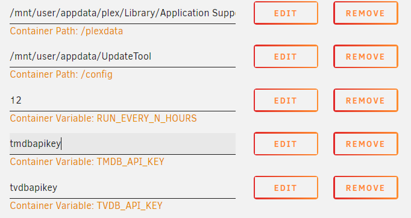

# Rating update tool for IMDB ratings in Plex libraries

A tool to update the IMDB ratings for Plex libraries that contain movies and series. 

It matches movie libraries using the IMDB, TMDB agents and series (TV shows) libraries via the TVDB, TMDB TV Show agents.

## Warnings

&#x1F534; **As of today (20.02.2020) there have been two reports of corrupted databases! Please use this tool with caution, the matter is being investigated as this tool uses transactions on DB related operations and the actual DB connection time is minimal. The corruptions probably have something to do with a bugged Unraid version. If this happens to you, open an issue here with both relevant Plex / Unraid logs! Make sure you have a database backup to restore if necessary (Plex should create them automatically!). Instructions on how to repair a corrupt database are [here](https://support.plex.tv/articles/201100678-repair-a-corrupt-database/). This tool has been used by quite a large userbase and it has not caused any corruption issues in the past which makes the matter quite mysterious. After checking on SQLites ["how to corrupt a database"](https://www.sqlite.org/howtocorrupt.html) it is not apparent which issues these two users faced. If you want to be 100% sure, stop Plex, run the tool, stop the tool, start Plex to prevent any concurrency (which SQLite should handle without issues and did so in the past).** &#x1F534;

#### This tool could in theory break if either the Plex database schema changes or IMDB stops providing a public rating dataset! This would not be dangerous tho as it stops when something goes wrong. 

#### If you want to run this on Windows without docker look [here](https://github.com/mynttt/UpdateTool/wiki/Installation-on-Windows)!

#### TV Show updates are done by aired season / aired episode. If you use DVD order for some reason please create an issue and I will implement a flag for you to switch the tool between. Plex uses aired season / aired episode by default tho!

## What does this do?

The Plex IMDB agent is kind of meh... Sometimes it is not able to retrieve the ratings for newly released movies even tho it matches the IMDB ID with them. It is impossible to comfortable add the rating manually from the users perspective.

This tool allows you to update the database that stores this data with the correct IMDB ratings. It will correct outdated and missing ratings and also set a flag to display the IMDB badge next to the ratings. The source used to retrieve the ratings is the official IMDB dataset that is updated daily and free for non-commercial use. Its download and refreshment will be handled automatically by this tool.

An advantage is that it works outside Plex by manipulating the local Plex database. Thus, no metadata refresh operations have to be done within Plex. It is faster and will not lead into the unforeseen consequences that one sometimes experiences with a Plex metadata refresh (missing or changed posters if not using a custom poster).

Before (Not IMDB matched)            |  After Match
:-------------------------:|:-------------------------:
  |  

*Above are two different movies, that why the genres changed*

### This tool processes the following libraries:

Type | Description | Agent
:-------------------------:|:-------------------------:|:-------------------------:
MOVIE | Plex Movie Agent with IMDB | com.plexapp.agents.imdb
MOVIE | TMDB Movie Agent (if TMDB API key set) | com.plexapp.agents.themoviedb
TV SHOW | TMDB Series Agent (if TMDB API key set) | com.plexapp.agents.themoviedb
TV SHOW | TVDB Series Agent (if TVDB auth string set) |com.plexapp.agents.thetvdb

In my library with 1800 movies it transformed entries for 698 items and 1000+ entries for series. If it is left running, every few days when a new IMDB data set is pulled a few ratings will update as well.

# Docker

Docker is on [dockerhub](https://hub.docker.com/r/mynttt/updatetool) | [UnRaid instructions](#docker-on-unraid-in-the-docker-tab-without-commands)

## Environment Variables Guide

Name | Description
:-------------------------:|:-------------------------:|
TMDB_API_KEY|Enables TMDB Movie/Series library processing
TVDB_AUTH_STRING|Enables TVDB Series library processing
IGNORE_LIBS|Ignore libraries with certain IDs ([more here](#Ignore-libraries-from-being-updated))
CAPABILITIES|Custom flags for the tool ([more here](#supply-custom-capability-flags))

## To run your docker:

```bash
docker pull mynttt/updatetool

# Without TMDB fallback

docker run -dit -e RUN_EVERY_N_HOURS=12 \
    -v "/mnt/data/Plex Media Server":/plexdata \
    -v "/mnt/data/imdpupdaterconfig":/config \
    mynttt/updatetool

# With TMDB fallback

docker run -dit -e RUN_EVERY_N_HOURS=12 \
    -e TMDB_API_KEY=yourkey \
    -v "/mnt/data/Plex Media Server":/plexdata \
    -v "/mnt/data/imdpupdaterconfig":/config \
    mynttt/updatetool
    
# With TMDB fallback and TVDB resolvement for series

docker run -dit -e RUN_EVERY_N_HOURS=12 \
    -e TMDB_API_KEY=yourkey \
    -e TVDB_AUTH_STRING="tvdbusername;tvdbuserid;tvdbapikey" \
    -v "/mnt/data/Plex Media Server":/plexdata \
    -v "/mnt/data/imdpupdaterconfig":/config \
    mynttt/updatetool
```

Explained:

```bash
docker run -dit 
     # Invoke every 12h
    -e RUN_EVERY_N_HOURS=12 \
     # Optional parameter: will try to get an IMDB ID from TMDB matched items
    -e TMDB_API_KEY=yourkey \
     # Three items are required to auth with TVDB username, userkey, apikey
     # Supply these as semicolon seperated values. Example: username;DAWIDK9CJKWFJAWKF;e33914feabd52e8192011b0ce6c8
    -e TVDB_AUTH_STRING="tvdbusername;tvdbuserkey;tvdbapikey" \
     # The plex data root (that contains Plug-ins, Metadata, ...
     # https://support.plex.tv/articles/202915258-where-is-the-plex-media-server-data-directory-located/
    -v "/mnt/data/Plex Media Server":/plexdata \
     # A path where you want to store the log and state files
    -v "/mnt/data/imdpupdaterconfig":/config \
    mynttt/updatetool
```

[TVDB User Key](https://thetvdb.com/dashboard/account/editinfo) - [TVDB API Key](https://thetvdb.com/dashboard/account/apikey)

*"/mnt/data/Plex Media Server" and "/mnt/data/imdpupdaterconfig" are just sample paths! Set your own paths there or it will probably not work!*

*On windows the \ syntax to make the command multiline will not work. You have to remove those and make the command a single line command!*

## Other configuration values

### Ignore libraries from being updated

You can ignore libraries by setting the environment variable **IGNORE_LIBS**.

IGNORE_LIBS takes a list of library ids as a semicolon seperated string. You can find the id of a plex library by opening it in plex and then looking at the URL in the browser.

```
Lets find the ID for the library 'Movies':
1.) Select 'Movies' in the Plex web interface
2.) Look at the URL in the browser, it should end like this: &context=content.library&source=1
3.) source=1 tells us that the ID for 'Movies' is 1
```

**Examples:**

Ignoring only the library with ID 1: 

```
IGNORE_LIBS="1"
```

Ignoring the libraries with the IDs 1, 5, 8: 

```
IGNORE_LIBS="1;5;8"
```

### Supply custom capability flags

You can apply custom flags to the tool via the **CAPABILITIES** environment variable.

Currently the following flags exist:

Flag | Description
:-------------------------:|:-------------------------:|
NO_TV |Ignore all TV Show libraries
NO_MOVIE | Ignore all Movie libraries

Multiple flags can be supplied as a semicolon separated string.

**Examples:**

Don't process TV libraries

```
CAPABILITIES="NO_TV"
```

Render the tool useless by skipping TV and Movie libraries

```
CAPABILITIES="NO_TV;NO_MOVIE";
```

## Docker on UnRaid in the docker tab without commands

1.) You need the community application plugin.

2.) Apps -> Settings -> Enable additional search results from dockerHub to "Yes"

3.) Now you need to go to Apps and search for "mynttt".

4.) It will either show the UpdateTool container or nothing and allow you to display Dockerhub search results. Display them and install.

5.) Configure the paths and variables like this (with your own paths): 

**If you want to use TMDB fallback you will also have to add the variable TMDB_API_KEY!**

**If the /config folder does not exist yet in appdata unraid will create it! It is important to access logs easily!**



*TMDB and TVDB are optional settings that are not required for base movie imdb operations! TMDB unlocks matching for movies that have a TMBD match for whatever reason, TMDB matched series libraries and TVDB allows to update series as well!*

6.) You can now start the container. If it has errors it will stop. The log in the config folder shows you what it does or why it crashed if that happens.


# Technical details

This tool supplies one mode at the moment:

### docker mode
Provides a watchdog that once started will run every N hours over all IMDB supported libraries.

# Runtime requirements

- Java >= 11

# Created files in PWD

- cache-tmdb2imdb.json - If TMDB fallback is enabled this file will contain the resolved TMDB <=> IMDB mappings.
- cache-tvdb2imdb.json - TVDB to IMDB mapping.
- cache-cache-tmdbseries2imdb.json - TMDB TV Shows to IMDB mapping.
- cache-tvdbBlacklist.json - Items that TVDB provides no IMDB id for or that fail being looked up. The blacklist is reset every 14 days.
- cache-tmdbseriesBlacklist.json - Items that TMDB TV Shows provides no IMDB id for or that fail being looked up. The blacklist is reset every 14 days. 
- state-imdb.json - Set of jobs that have not finished
- xml-error-{uuid}-{library}.log - List of files that could not be updated by the XML transform step (not important tbh, plex reads from the DB)
- updatetool.{increment}.log - Log file
- rating_set.tsv - latest IMDB rating set
- ratingSetLastUpdate - UNIX timestamp of last rating set update

# Usage

### Docker mode:

In docker mode the tool will read the environment variable PLEX_DATA_DIR and optionally TMDB_API_KEY if TMDB fallback should be enabled.

It can then be invoked with:
- no args (every 12h)
- one arg (every n hour(s))

```
java -jar UpdateTool-xxx.jar imdb-docker [] | [{every_n_hour}]
```

Example:

```bash
# Export variables if on Linux/Mac
PLEX_DATA_DIR="/mnt/user/Plex Media Server"
export PLEX_DATA_DIR

# Export variables if on Windows
set PLEX_DATA_DIR=C:\User\Data\Plex Media Server

# Default start
java -jar UpdateTool-xxx.jar imdb-docker
# Run every 5 hours
java -jar UpdateTool-xxx.jar imdb-docker 5
```

# Other stuff

[Where is the data folder of the Plex Media Server located on my system?](https://support.plex.tv/articles/202915258-where-is-the-plex-media-server-data-directory-located/)

You can either build the tool yourself using the command below in the root folder or get it [here](https://github.com/mynttt/UpdateTool/releases/latest) as an already packaged .jar file.
```bash
gradle build
```
